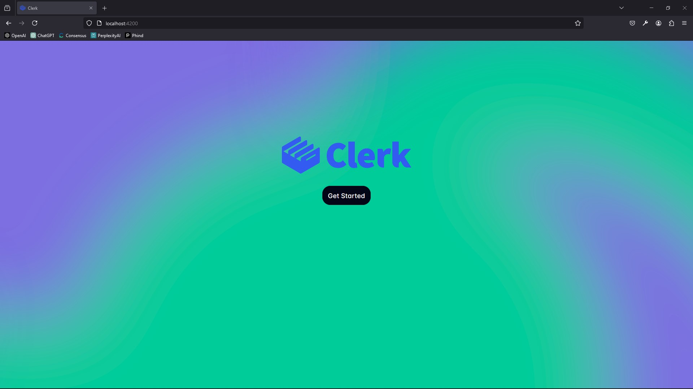
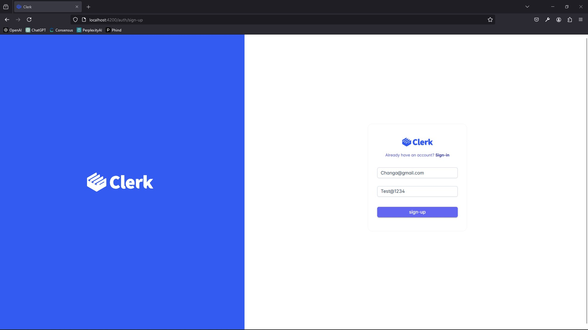
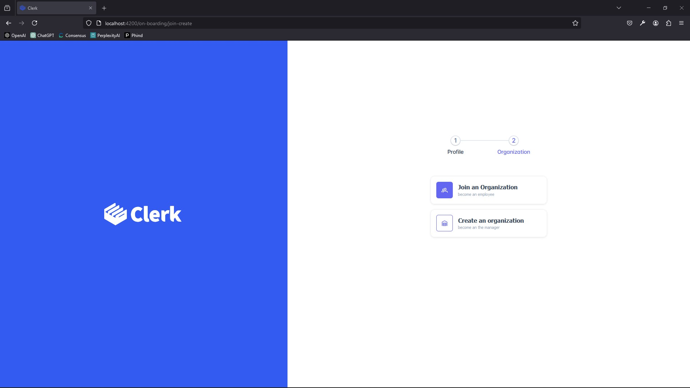
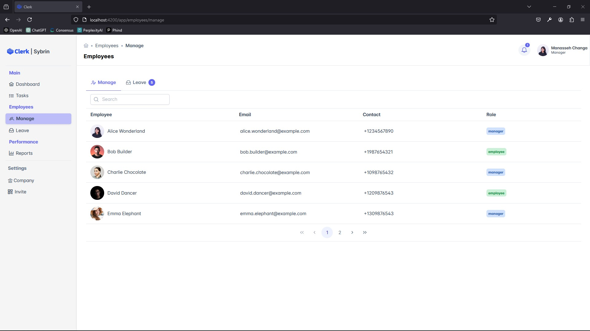

# Clerk Client

## Project Overview

Clerk Client
This Angular project is the Frontend of Clerk an Employee Management App

### Features

- Organization Management: users can create or join a company
- Employee Management: a manager of a company can manage, employee leave request and schedule and edit employee data,
- Task Management: Managers can assign employees tasks
- Reports: based on task performance reports can be generated
- User Authentication: Jwt authentication has been used, with session storage to keep the current user state

### Tech Stack

- Framework: Angular
- Component Library: PrimeNG
- Database: Postgres
- Server: C# ASP.NET [Clerk.Server](https://github.com/Clerk-HR/clerk.server).
- Authentication: JWT (JSON Web Tokens)
- Documentation: Swagger

### Screenshots

#### Landing Page

`landing-page`



#### Sign-Up

`Sign-Up`



#### On-Boarding

`Create or Join a Company`



#### Main User Interface

`Manage Employees`



## Folder Structure

```bash
- src/
  - Core/
    - Auth
    - Organization
    - Shared
    - User
  - Pages/
    - auth/
        - login
        - register
    - landing
    - main/
        - dashboard
        - tasks
        - employees
    - onboarding
```

## Setup Instructions

```bash
# Clone the repository
git clone https://github.com/Clerk-HR/clerk.client.git
```

# ClerkClient

This project was generated with [Angular CLI](https://github.com/angular/angular-cli) version 17.3.0.

## Development server

Run `ng serve` for a dev server. Navigate to `http://localhost:4200/`. The application will automatically reload if you change any of the source files.

## Code scaffolding

Run `ng generate component component-name` to generate a new component. You can also use `ng generate directive|pipe|service|class|guard|interface|enum|module`.

## Build

Run `ng build` to build the project. The build artifacts will be stored in the `dist/` directory.
